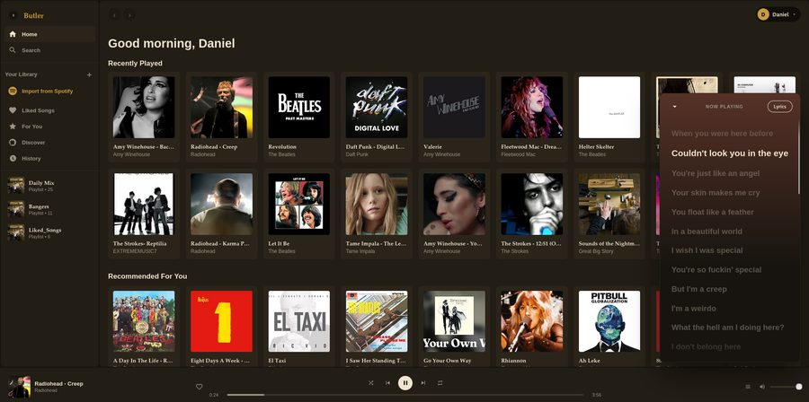
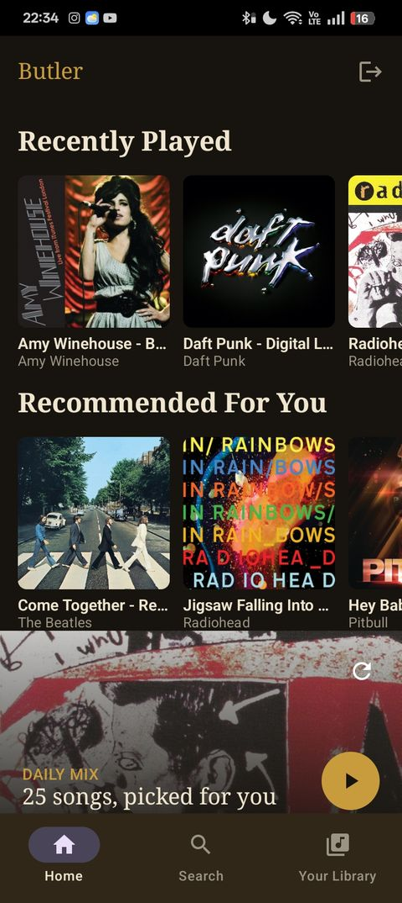
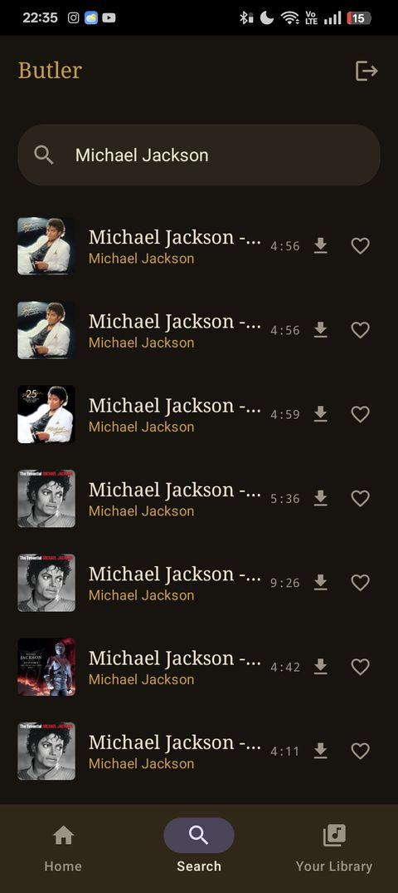
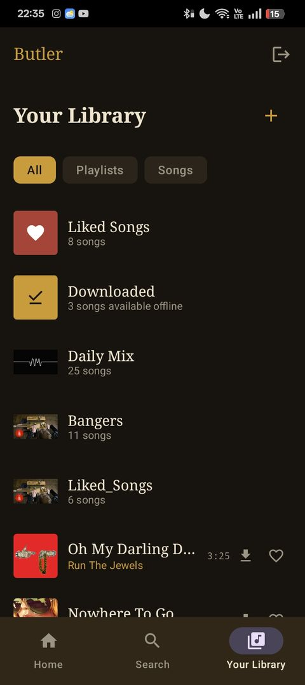
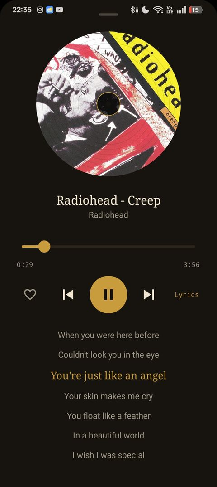

<p align="center">
  
</p>

<h1 align="center">Butler</h1>

<p align="center">
  <a href="https://github.com/DGuckert/Butler/releases/latest">
    
  </a>
</p>

A self-hosted Spotify alternative. Download music with `yt-dlp`, organize it into a personal library, and stream it from a Spotify-style web UI with crossfade, queue, playlists, synced lyrics, and multi-user family accounts.

## Showcase

<p align="center">
  
</p>

<p align="center"><em>Web player — desktop</em></p>

<p align="center">
  
  
  
  
</p>

<p align="center"><em>Android app — Home, Search, Library, and synced-lyrics Now Playing screen</em></p>

## Features

### Core Playback & Library
- **Web player** with crossfade, queue management, and persistent playback state
- **Album art** with fallback to artist images and graceful degradation
- **Cross-device playback control** — control what's playing from any device
- **Artist pages** with biography (via MusicBrainz)

### Music Discovery & Personalization
- **Daily Mix generator** — weighted random samples, no setup, but only pulls from music already in your library
- **Spotify OAuth integration** to import existing playlists
- **ListenBrainz scrobbling** — sync your listening history

### Lyrics & Metadata
- **Live synced lyrics** on web and Android (YouTube + LyricFind resolution with 2-second tolerance)
- **Album art caching** with automatic cleanup
- **Song metadata** auto-enriched from downloads and existing files

### Multi-User & Admin
- **Multi-user accounts** via invite codes (admin can generate and manage)
- **JWT-based auth** with bcrypt password hashing
- **Single sign-on (SSO)** via Google or any self-hosted OIDC provider (Authelia, Authentik, Keycloak, ...) -- optional, on top of normal accounts, configurable per deployment
- **Admin panel** for library management, settings, and user control

### Music Management
- **Download via yt-dlp** with retry logic for resilience
- **Manual upload folder** with auto-indexing (mp3, m4a, flac, opus, ogg, wav, aac)
- **Lossless download setting** for admin-controlled audio quality
- **Automatic folder scanning** every few minutes, or manual "Scan Now" trigger

### API & Compatibility
- **Subsonic API compatibility** for third-party client support
- **Offline downloads** on Android with sync across devices

### Mobile (Android)
- **Native Kotlin/Compose app** with 1:1 feature parity to web
- **Offline playback** with selective download management
- **Android Auto support** for in-car control
- **Real-time playback sync** across devices
- **SSO login** via Chrome Custom Tabs, same providers as the web login

## Requirements

- Python 3.10+
- `ffmpeg` (required by `yt-dlp` for audio extraction)
- Docker (for containerized deployment) or systemd (for native service)

## Quick Start

### Docker (Recommended)

```bash
git clone https://github.com/DGuckert/Butler.git
cd Butler
docker compose build butler
docker compose up -d
```

Open `http://localhost:8080`, register the first account (becomes admin), and manage users/settings via `/admin`.

### Native Installation

```bash
git clone https://github.com/DGuckert/Butler.git
cd Butler
bash setup.sh
```

Edit `.env` — at minimum, set a real `SECRET_KEY`:

```bash
python3 -c "import secrets; print(secrets.token_urlsafe(48))"
```

Then start:

```bash
uvicorn main:app --host 0.0.0.0 --port 8080
```

### Systemd Service (Optional)

`butler.service.example` is a template systemd unit:

```bash
sudo cp butler.service.example /etc/systemd/system/butler.service
# Edit paths/user as needed
sudo systemctl daemon-reload
sudo systemctl enable --now butler
```

## Configuration

All settings via `.env`:

| Variable | Purpose | Default |
|----------|---------|---------|
| `SECRET_KEY` | JWT signing key (generate with `secrets.token_urlsafe(48)`) | Required |
| `SPOTIFY_CLIENT_ID` / `SPOTIFY_CLIENT_SECRET` | OAuth playlist import | (optional) |
| `LISTENBRAINZ_USER_TOKEN` | Scrobbling support | (optional) |

See [Single Sign-On](#single-sign-on-sso) below for the SSO-specific variables.

A couple of settings are runtime-toggleable from the admin panel instead of `.env` (Admin tab, "Server Settings" -- takes effect immediately, no restart):
- **Lossless downloads** -- keep the original downloaded format (Opus/AAC) instead of transcoding to mp3. Only affects songs downloaded from then on.
- **Automatic downloads** -- whether playing/searching for a song not yet in the library triggers a yt-dlp download. Turn off to freeze the library to what's already downloaded or manually uploaded; existing songs still play normally either way.

## Features in Detail

### Manual Music Library

Drop files into `uploads/` (any of mp3, m4a, flac, opus, ogg, wav, aac). Butler scans automatically every few minutes, reading embedded tags or parsing "Artist - Title.ext" filenames.

Admins can also trigger immediate scan from **Family/Admin → Scan Now**.

### Offline Download (Android)

Selectively download tracks to your device. Downloaded content syncs across all your devices via the backend.

### Subsonic API

Use any Subsonic-compatible client (Subtracks, Dsub, etc.) to connect to your Butler instance.

### Single Sign-On (SSO)

Butler supports logging in through Google or any self-hosted OIDC provider (Authelia, Authentik, Keycloak, and similar), on top of the normal username/password accounts -- enable as many at once as you want, and each shows up as its own button on the login screen.

Set `OIDC_PROVIDERS` in `.env` to a comma-separated list of provider keys, then fill in that provider's credentials:

```bash
# One redirect URI for all providers -- register this exact URL with
# every provider's console (Google Cloud Console, your Authelia client, etc).
OIDC_REDIRECT_URI=https://your-domain.example/auth/oidc/callback
OIDC_PROVIDERS=google,authelia

# Google -- OAuth Client ID, type "Web application", at
# https://console.cloud.google.com/apis/credentials
GOOGLE_CLIENT_ID=
GOOGLE_CLIENT_SECRET=

# Any self-hosted OIDC provider -- pick your own key (lowercase, no
# spaces), add it to OIDC_PROVIDERS, then set these three with that key
# as the prefix. Example for a provider key of "authelia":
AUTHELIA_ISSUER=https://auth.your-domain.example
AUTHELIA_CLIENT_ID=butler
AUTHELIA_CLIENT_SECRET=
AUTHELIA_DISPLAY_NAME=Sign in with Authelia   # optional, shown on the login button
```

A brand-new SSO identity needs an invite code the first time, exactly like a normal registration -- except if the server has no users yet, in which case the first SSO login bootstraps the admin account. Once linked, that identity logs in with just the button, no code needed.

On Android, SSO opens in a Chrome Custom Tab rather than an in-app WebView (so you get your browser's existing session/password manager) and hands control back to the app via a deep link once the provider redirects back.

See `.env.example` for the full list of variables, including the exact fields Google's/each self-hosted provider's setup asks for.

### API keys

SSO accounts don't have a real password -- there's nothing to type into a third-party Subsonic client (DSub, Substreamer, Symfonium, etc.). Generate a personal API key from the account menu ("API keys") and use it in place of a password anywhere Butler asks for one, native login included. No client-side setup needed beyond that; most Subsonic apps have a "legacy authentication" toggle that needs to be on for this to work (Substreamer specifically requires it under Advanced options on the login screen).

See [`CLIENT_API.md`](CLIENT_API.md) for the full API reference (both the native API and the Subsonic-compatible layer) if you want to build your own client.

## Android App

**[Download the latest release](https://github.com/DGuckert/Butler/releases/latest)** — signed APK, ready to sideload. Point it at your own Butler server on first launch.

Features:
- Full playback control with offline support
- Real-time sync with web player
- Android Auto for car control
- Persistent queue and playback state

### Building from source

```bash
cd android
./gradlew :app:assembleDebug
```

Debug APK is at `app/build/outputs/apk/debug/app-debug.apk`. Install on your device or emulator.

## Architecture

- **Backend**: FastAPI (Python 3.10+) with SQLite
- **Web Frontend**: Vanilla JS (no framework)
- **Android App**: Kotlin with Jetpack Compose
- **Deployment**: Docker or systemd

Databases (`butler.db`, `songs_meta.db`) and `music/` folder are created at runtime and not tracked in git — they're local to your library.

## Development & Contributing

See [CONTRIBUTING.md](CONTRIBUTING.md) for guidelines.

## License

MIT — see [LICENSE](LICENSE).

---
